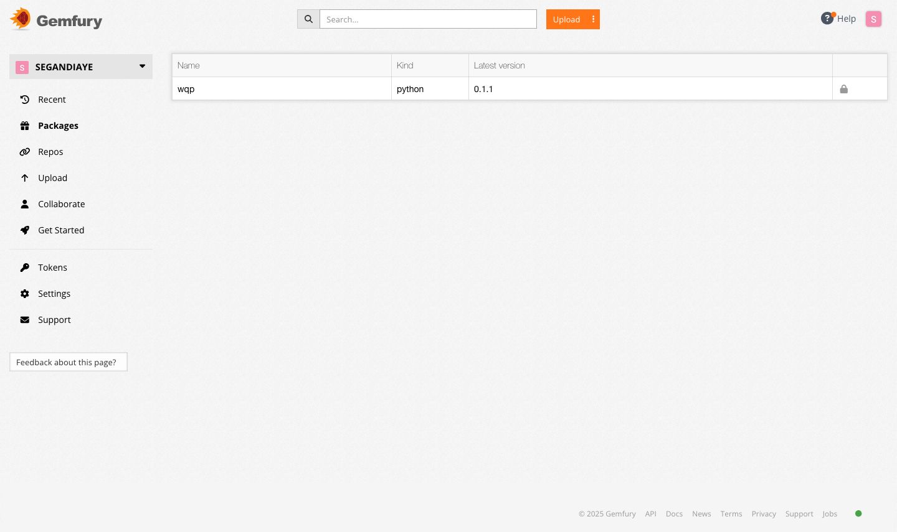
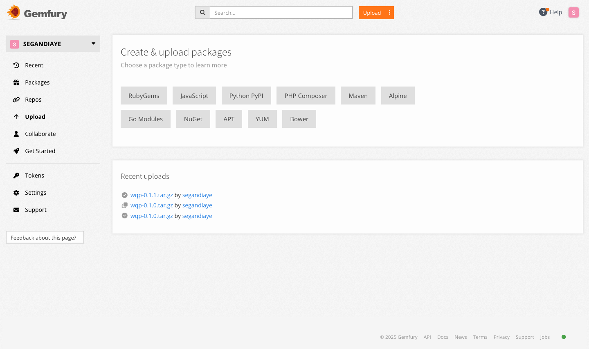

# Build machine learning code package

[](https://codecov.io/gh/segandiaye/Productionizing-Machine-Learning-Code)

Example of building machine learning code package

# Deployment on GemFury


- Go to the GemFury web UI and login to your account
- You should end up in this url: https://manage.fury.io/dashboard/YOUR_ACCOUNT/repos/-/intro
- On the left side, click "Upload"
- Click Python PyPI

```bash
python setup.py sdist # Create the dist directory or use python -m build
export FURY_PUSH_TOKEN=XXX_THE_VALUE_OF_YOUR_TOKEN_HERE # Be careful to not commit to git any token!!
export FURY_USER_NAME=XXX_$GITHUB_USERNAME
curl -F package=@dist/xxx-1.0.0.tar.gz "https://$FURY_PUSH_TOKEN@push.fury.io/$FURY_USER_NAME/"
```

You should see as below :



# Install package my wqp from GemFury

As you can see my package versions are avalable here :



```bash
pip install -i https://pypi.fury.io/$FURY_USER_NAME/ wqp
```